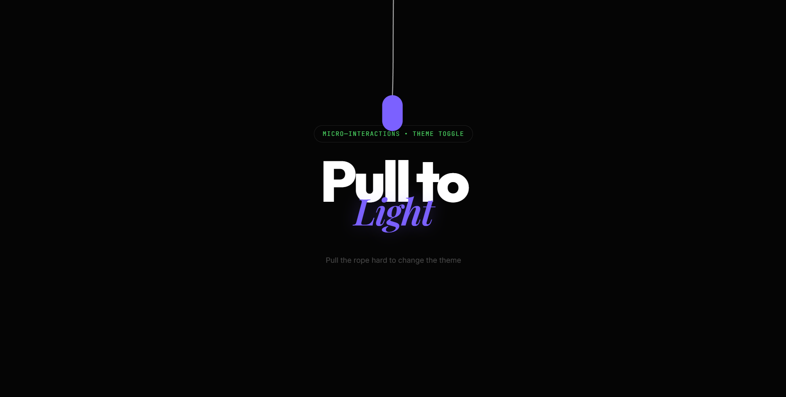
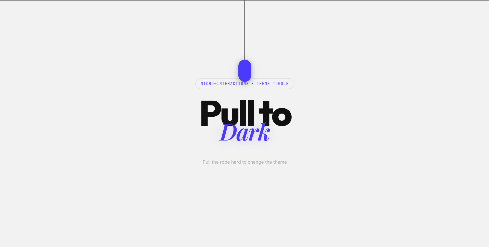

# 💡 Pull to Light

  

An aesthetic, minimal theme toggle interaction featuring advanced rope physics and editorial-style typography.

## Live Link
[Live Link](https://pull-to-light.vercel.app/)

## ✨ Features

- **Advanced Rope Physics**: Built with **Verlet Integration**, the rope responds dynamically to movement with realistic swaying, whipping, and ripples.
- **Premium Typography**: A sophisticated mix of **Outfit** (Bold Sans) and **Playfair Display** (Italic Serif) for a high-end editorial look.
- **Responsive Interactions**: Supports both Mouse and Touch events with a spring-based physics engine for the theme toggle.
- **Micro-Interactions**: Subtle glows, haptic feedback (vibration), and smooth color transitions (0.6s cubic-bezier).

## 🛠️ Technology Stack

- **Vanilla JavaScript**: Custom physics engine without external libraries.
- **HTML5 & SVG**: Vector-based rendering for the rope and handle.
- **CSS3 Variables**: Efficient theme management for Light and Dark modes.
- **Google Fonts API**: Dynamic typography loading.

## 🚀 How to Run

1. Clone or download the repository.
2. Open `index.html` in any modern web browser.
3. Drag the purple capsule handle down to toggle the light!

## 📸 Visuals

### Dark Mode

### Light Mode

### Video Walkthrough
[Watch the Walkthrough Video](./media/walkthrought_edited.mp4)

---

